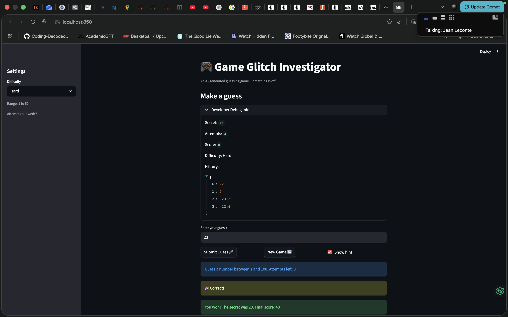
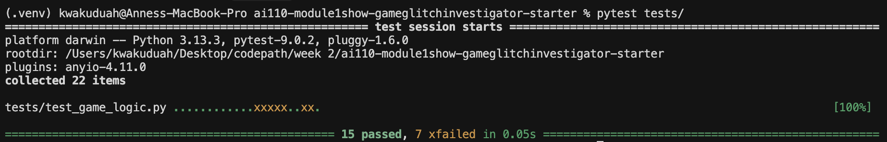
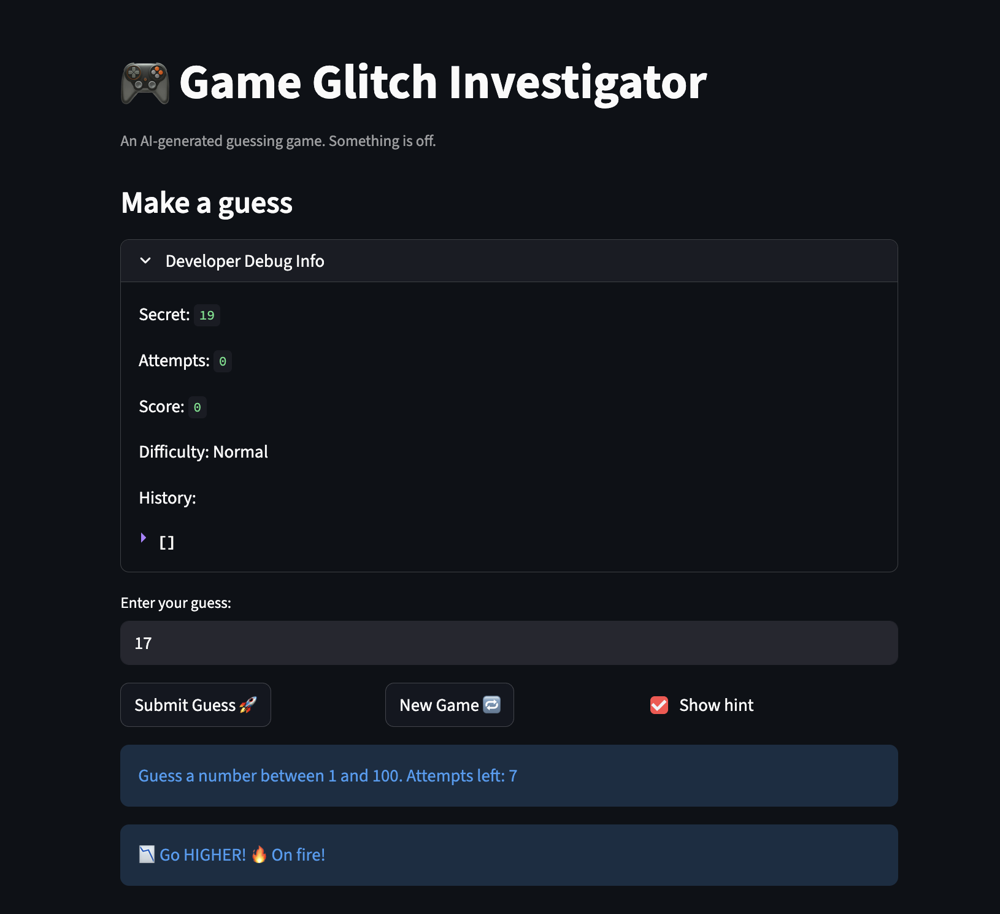

# 🎮 Game Glitch Investigator: The Impossible Guesser

## 🚨 The Situation

You asked an AI to build a simple "Number Guessing Game" using Streamlit.
It wrote the code, ran away, and now the game is unplayable. 

- You can't win.
- The hints lie to you.
- The secret number seems to have commitment issues.

## 🛠️ Setup

1. Install dependencies: `pip install -r requirements.txt`
2. Run the broken app: `python -m streamlit run app.py`

## 🕵️‍♂️ Your Mission

1. **Play the game.** Open the "Developer Debug Info" tab in the app to see the secret number. Try to win.
2. **Find the State Bug.** Why does the secret number change every time you click "Submit"? Ask ChatGPT: *"How do I keep a variable from resetting in Streamlit when I click a button?"*
3. **Fix the Logic.** The hints ("Higher/Lower") are wrong. Fix them.
4. **Refactor & Test.** - Move the logic into `logic_utils.py`.
   - Run `pytest` in your terminal.
   - Keep fixing until all tests pass!

## 📝 Document Your Experience

- [x] Describe the game's purpose.
  Glitchy Guesser is a number guessing game where the player tries to guess a secret number within a limited number of attempts. The game supports three difficulty levels (Easy, Normal, Hard) that control the number range and attempt limit. A scoring system rewards faster wins and penalizes wrong guesses.

- [x] Detail which bugs you found.
  1. **Swapped hint messages** — when the guess was too high, the hint said "Go HIGHER!" and when too low it said "Go LOWER!", sending the player in the wrong direction every time.
  2. **Attempts display off by one** — the "Attempts left" counter in the info bar was computed before the submit handler ran, so it showed one more attempt remaining than was actually true on the final guess.
  3. **Score inconsistency** — the Developer Debug Info showed a different score value than the win/loss message because the display and the message read `st.session_state.score` at different points in the same render cycle.
  4. **History board not cleared on New Game** — clicking "New Game" did not reset `st.session_state.history`, so guesses from previous games kept appearing in the debug history list.
  5. **Game blocked after New Game** — `st.session_state.status` and `st.session_state.score` were also not reset, causing `st.stop()` to fire immediately on the next render and making the new game unplayable.

- [x] Explain what fixes you applied.
  1. **Hint messages** — swapped the return strings in `check_guess()` in `logic_utils.py` so `guess > secret` returns `"📈 Go LOWER!"` and `guess < secret` returns `"📉 Go HIGHER!"`.
  2. **Attempts display** — moved the `st.info()` call to after the submit button is defined and added `(1 if submit else 0)` to `display_attempts` so the counter reflects the attempt that is about to be counted.
  3. **New Game reset** — added `st.session_state.history = []`, `st.session_state.status = "playing"`, and `st.session_state.score = 0` to the `new_game` block so all relevant state is cleared together before any rerun.

## 📸 Demo

- 
- 

## 🚀 Stretch Features

-  